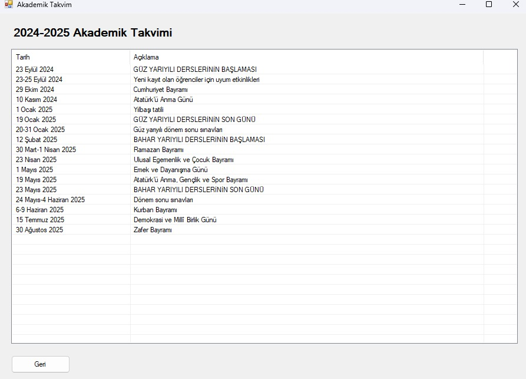

# 🎓 Öğrenci Bilgi Sistemi (OBS)

Bu proje, üniversite öğrencileri için geliştirilmiş modern bir Öğrenci Bilgi Sistemi'dir. Windows Forms kullanılarak C# ile geliştirilmiştir.

## 🚀 Özellikler

- **📊 Not Görüntüleme**
  - Dönem bazlı not listeleme
  - Vize, final, ödev ve proje notları
  - Ders başarı durumu ve harf notu takibi
  - GANO hesaplama

- **📅 Sınav Takvimi**
  - Güncel sınav programı
  - Sınav yeri ve saati bilgileri
  - Sınav türü (Vize, Final, Bütünleme)

- **📋 Akademik Takvim**
  - Dönem başlangıç/bitiş tarihleri
  - Resmi tatiller
  - Önemli akademik tarihler

- **📝 Transkript**
  - Detaylı akademik geçmiş
  - Dönemlik ve genel not ortalamaları
  - Alınan tüm derslerin listesi

- **🔔 Duyurular**
  - Fakülte duyuruları
  - Bölüm duyuruları
  - Ders bazlı duyurular

- **👥 Danışman Bilgileri**
  - Danışman öğretim üyesi bilgileri
  - İletişim bilgileri

- **📊 Devamsızlık Takibi**
  - Ders bazlı devamsızlık durumu
  - Dönemlik devamsızlık özeti

## 💻 Teknik Özellikler

- **Dil:** C#
- **Framework:** .NET Framework
- **Arayüz:** Windows Forms
- **Veritabanı:** Local JSON dosyaları

## 🛠️ Kurulum

1. Projeyi klonlayın:
```bash
git clone https://github.com/mertsemih/obs.git
```

2. Visual Studio ile projeyi açın
3. Gerekli NuGet paketlerini yükleyin
4. Projeyi derleyin ve çalıştırın

## 📸 Ekran Görüntüleri

### Ana Sayfa


### Not Görüntüleme


### Sınav Takvimi


### Akademik Takvim


### Transkript


### Devamsızlık Durumu


## 📞 İletişim
semihmertsariyerli.06@gmail.com
